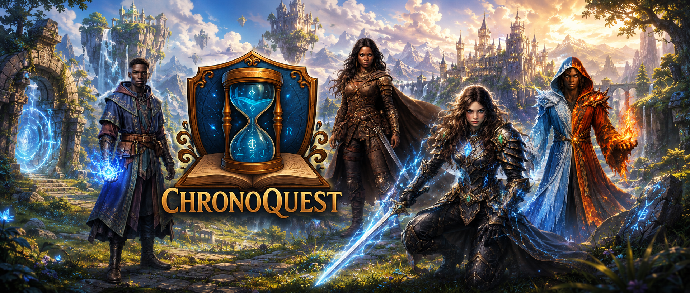
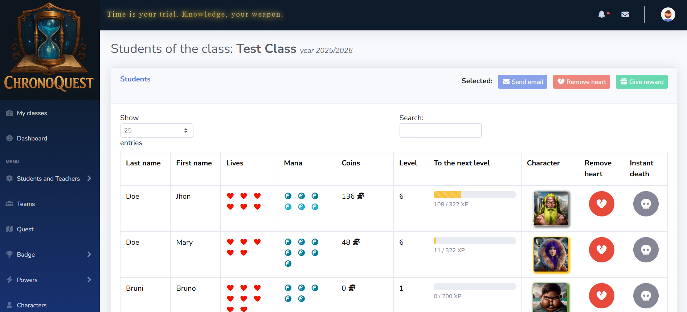
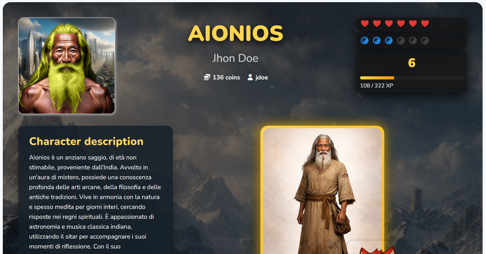
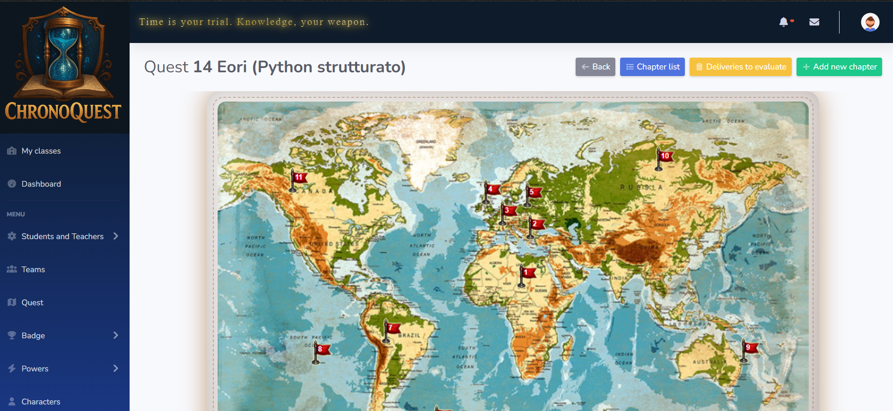
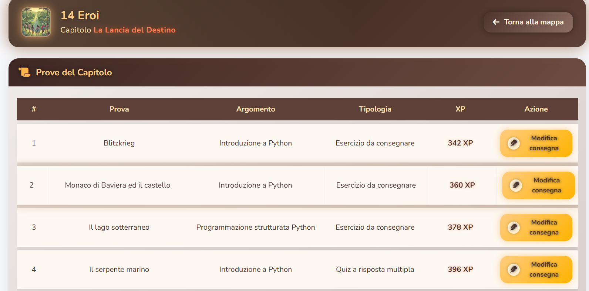
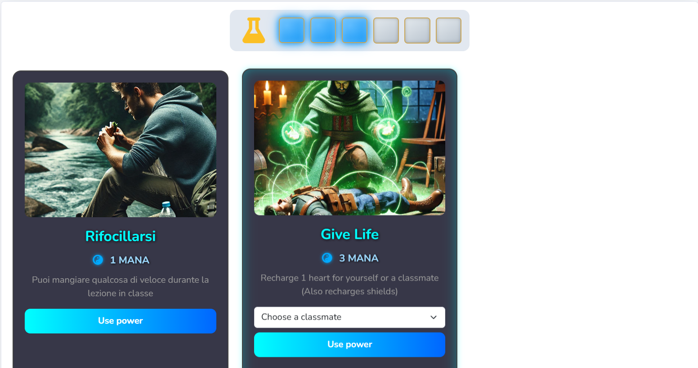
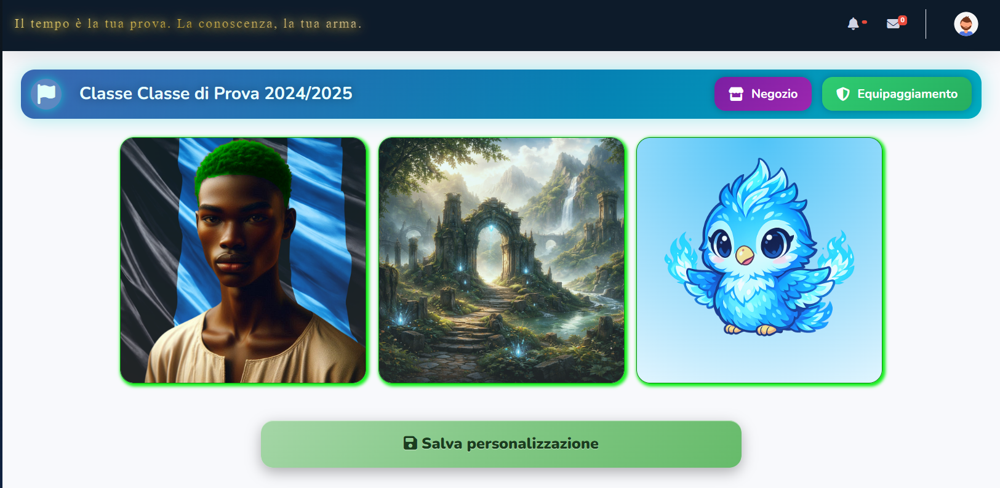

# ChronoQuest

  

# ChronoQuest

## Turn Your Classroom Into an Adventure

  
  
  
  

ChronoQuest is a **free and open source gamification platform** designed for teachers who want to transform classroom activities into engaging adventures.

Students become heroes, complete quests, gain experience points, unlock badges, earn rewards and progress through their educational journey.

ChronoQuest is released under the **GNU GPL v3** license and is completely free to use.

---

# ✨ Features

- 🏫 Classroom management
- 🧙 Hero creation and customization
- ⚔️ Quest and mission system
- ⭐ Experience Points (XP)
- 📈 Level progression
- 🏅 Achievements & badges
- 🎁 Rewards and customizations
- 📝 Test Creator
- 📊 Student statistics
- 🎨 Highly customizable
- 🔓 100% Free & Open Source

---

# 📸 Screenshots

Replace the following placeholders with your real screenshots.

## Dashboard

## Hero Editor

## Quest Editor

## Exercises

## Powers

## Personalizzazioni

---

# 🚀 Why ChronoQuest?

ChronoQuest was born with a simple goal:

> **Make classroom gamification available to every teacher without subscriptions, premium plans or locked features.**

Unlike many educational platforms, ChronoQuest is:

- Free forever
- Open Source
- Community-driven
- Easy to customize
- Built by a teacher, for teachers

The long-term vision is to build a community where educators can freely share quests, heroes, powers, badges, rewards, printable tests and educational resources.

---

# 📥 Download

Latest release:

https://chronoquest-academy.com/download.php

**Current version:** ChronoQuest 1.0

---

# 📚 Documentation

https://chronoquest-academy.com/documentazione.php

---

# 🤝 Community

https://chronoquest-academy.com/shop.php

Teachers will be able to share:

- Quests
- Heroes
- Badges
- Rewards
- Educational resources

---

# 🌍 Website

https://chronoquest-academy.com

---

# 💻 Technology

- PHP
- HTML5
- CSS3
- JavaScript
- MySQL

---

# 🤝 Contributing

Contributions are welcome!

You can:

- Report bugs
- Suggest new features
- Improve the code
- Translate ChronoQuest
- Create quests
- Create heroes
- Design badges
- Improve documentation

---

# 📜 License

This project is distributed under the **GNU General Public License v3.0 (GPL-3.0)**.

See the LICENSE file for more details.

---

# ❤️ Vision

ChronoQuest aims to become a complete ecosystem where teachers can freely create, share and reuse educational content, making gamification accessible to schools around the world.

Every contribution helps improve education through collaboration.

---

# ⭐ Support the project

If you like ChronoQuest:

- Star this repository
- Share it with other teachers
- Report issues
- Suggest improvements
- Contribute to the project

Happy teaching!
